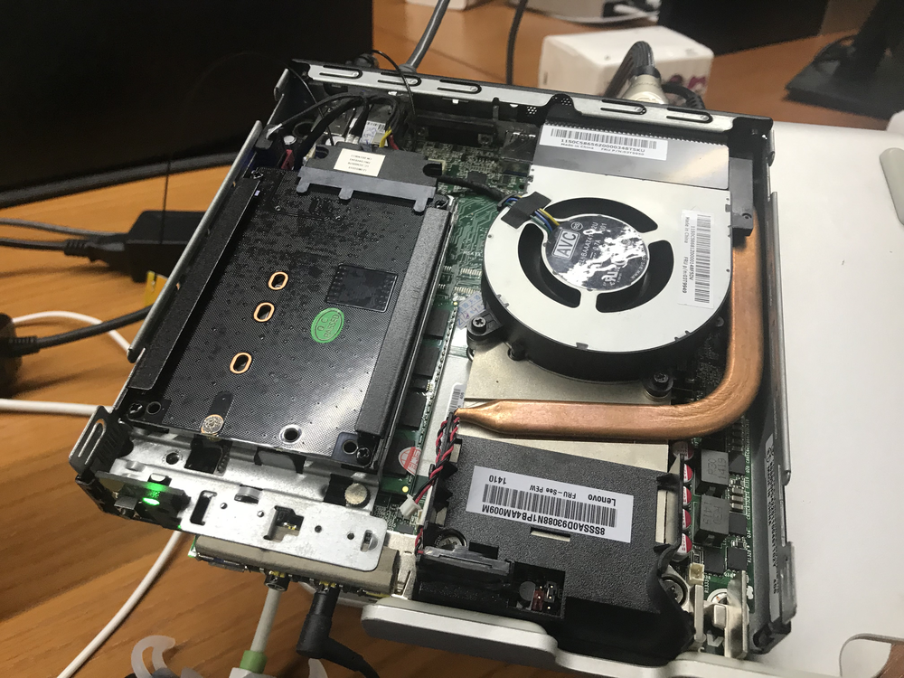

# 联想 Lenovo M93P 黑苹果（Hackintosh）配置



## 硬件概况

```
Computer model              Lenovo M93P
CPU                         Intel i7-4720HQ (8) @ 2.60GHz
Memory                      8g DDR3 1600 MHz Elpida x2 (16g)
Integrated graphics         Intel HD Graphics 4600
Audio                       Realtek @ Intel Lynx Point-LP High Definition Audio (ALC283)
Ethernet                    Realtek RTL8168/8111/8112 Gigabit Ethernet Controller / Lenovo
Wireless network adapter    Broadcom BCM43xx 1.0 (7.21.190.32 AirPortDriverBrcm4360-1315.1)
Operate System              Mojave 10.14.2
```

注：原先使用的是 i5-4570T CPU，后来因为性能的关系更改为 i7-4720HQ 的移动版魔改台式机 1150 型号。

## BIOS 设置

1. 设置核显的初始内存为 32M（这块很重要，有坑）；
2. CPU 设置中，禁用 VT-d；
3. 只使用 UEFI 模式。

## 显卡设置

设置显卡的过程有点难，原先使用是 i5-4570T CPU，其核显的型号是 HD4600，所以购买了笔记本的 CPU 型号也是 HD4600 。但是，同样的配置文件安装配置上去以后，出现了闪屏。

调试以后发现其实 ig-platform-id 是对的，但是需要打 DSDT 的补丁，这块是比较难点的地方。配置方面后来使用了 FB-Patcher 自动帮忙生成然后粘贴到 config.plist 里面搞定。

然后没有使用 WhatEverGreen 驱动，还是使用了仿冒的 FakePCIID 系列的驱动（注意，不要多加不必要的驱动，对稳定性没有任何的好处）。

## 声卡设置

声卡原先使用的是 AppleDHA 注入，考虑到这块需要拷贝扩展到 S/L/E 中并且对以后的升级也有可能存在问题，所以使用了 AppleALC + Lilu 以及 DSDT 配合注入的方式。在这里还是建议使用 FB-Patcher 这个工具，它能半自动帮你搞定 config.plist 中的部分配置。

## 其他

相比次的硬件（i5-4570T）这次的 EFI 目录更新主要是两个方面：

1. 精简了不必要的内核扩展（可能会更稳定和容易调试些）；
2. 使用了 DSDT 的全量补丁，驱动了移动版的 CPU 核显。
