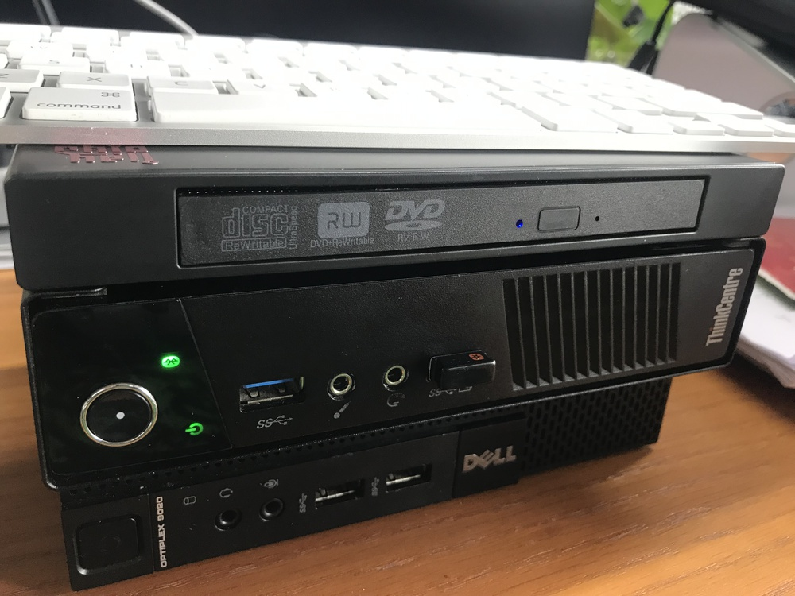
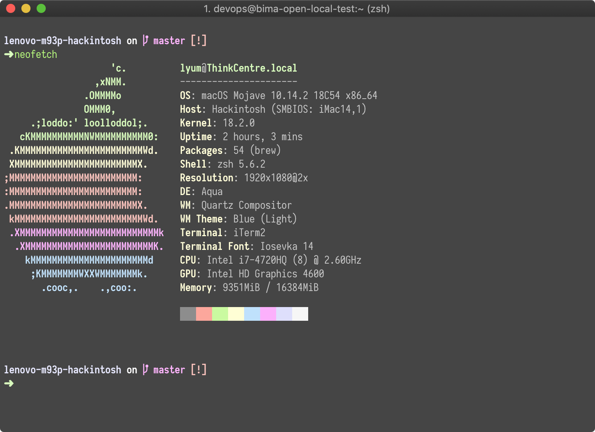
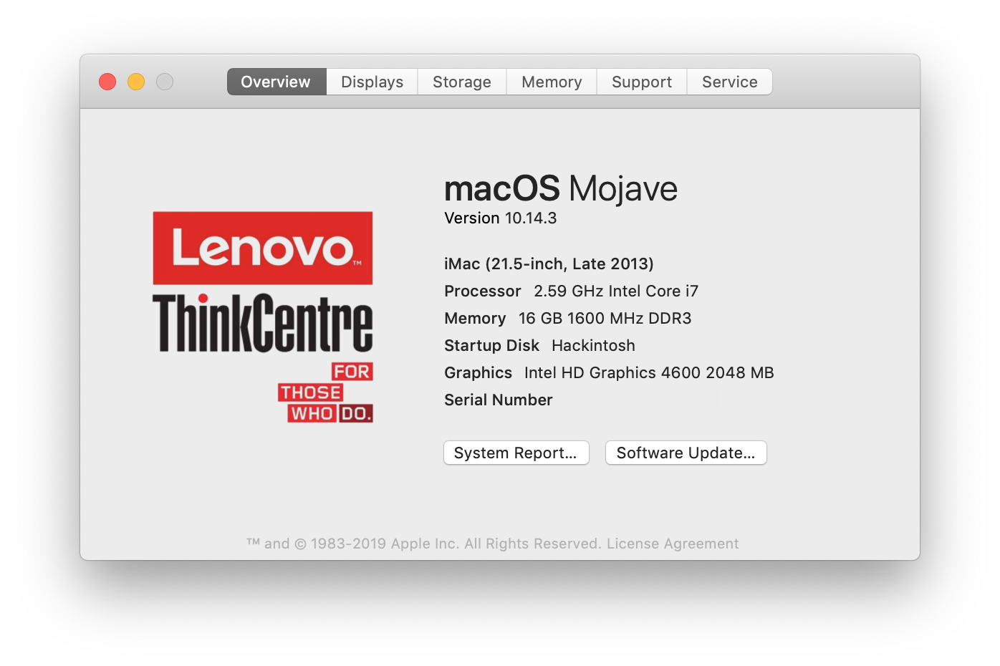
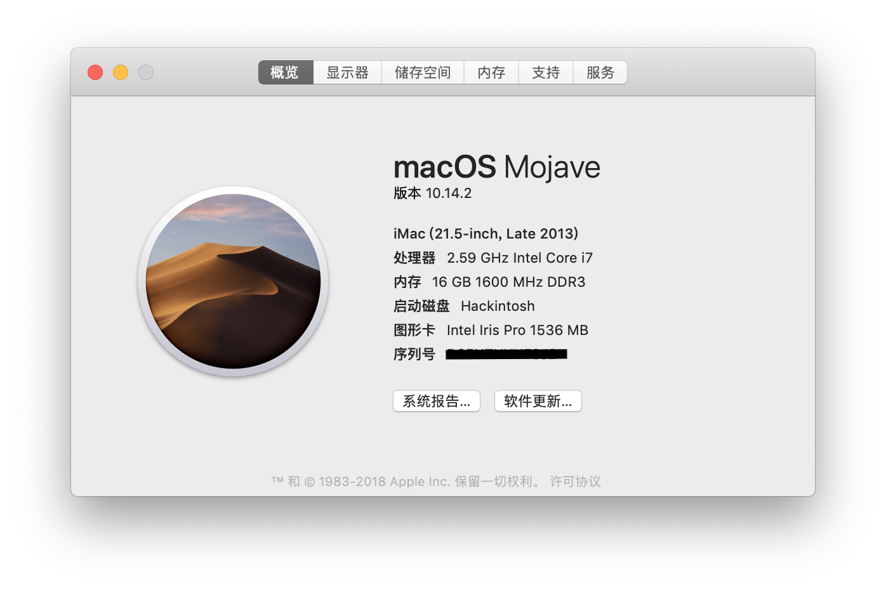
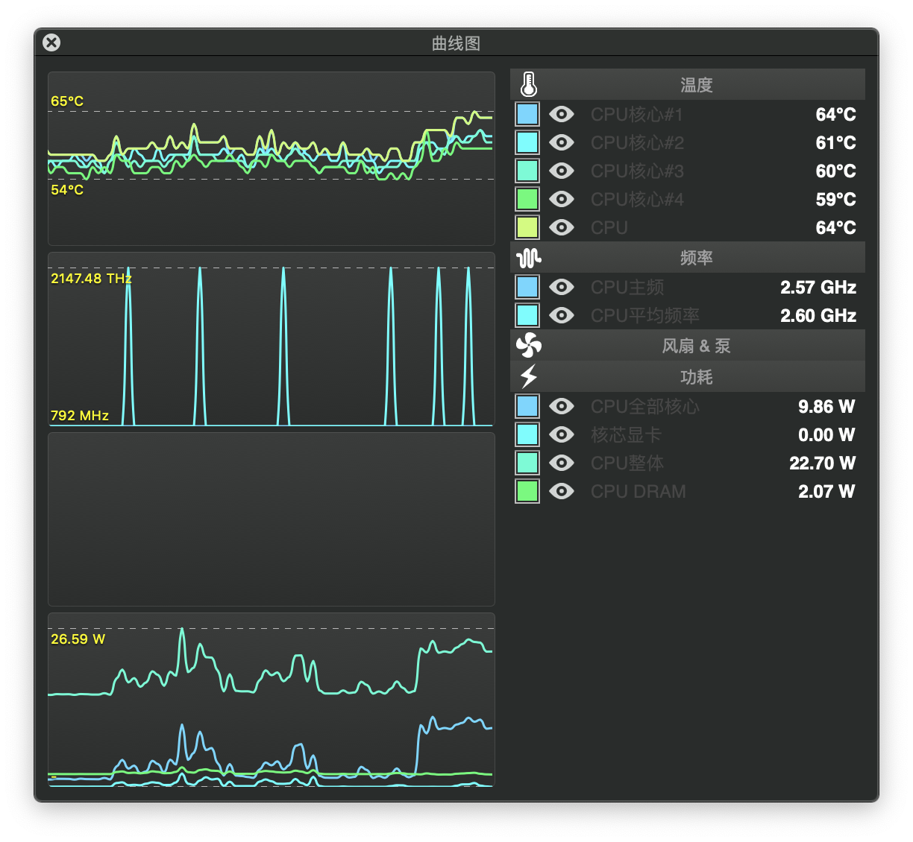

# Hackintosh for Lenovo ThinkCenter M93P 



## 概况

联想（Lenovo）的 M93P 是目前二手市场比较常见的掌上 PC 机，目前（2018年底）其二手准系统的价格一般在 300-400 上下。其使用 Q87 的芯片组，以及搭载四代的 Intel CPU 具有很高的性价比。

同时，四代的 Intel CPU 也是相对比较容易黑苹果的平台，因此出于易用性以及性价比方面考虑，根据 M93P 组装了黑苹果（Hackintosh）平台。

详细的配置单如下：

```
Computer model              Lenovo M93P
CPU                         Intel i7-4720HQ (8) @ 2.60GHz
Memory                      8g DDR3 1600 MHz Elpida x2 (16g)
Integrated graphics         Intel HD Graphics 4600
Audio                       Realtek @ Intel Lynx Point-LP High Definition Audio (ALC283)
Ethernet                    Realtek RTL8168/8111/8112 Gigabit Ethernet Controller / Lenovo
Wireless network adapter    Broadcom BCM43xx 1.0 (7.21.190.32 AirPortDriverBrcm4360-1315.1)
Operate System              Mojave 10.14.2
```

注：原先使用的是 i5-4570T CPU，后来因为性能的关系更改为 i7-4720HQ 的移动版魔改台式机 1150 型号。由于原机没有蓝牙和无线，因此加装了博通的 94352HMB 型号的网卡。

根据这个配置，已经拷机将近一个月的时间，使用稳定能够满足日常的工作任务。

*2019-01-30，硬件更新。* 使用了配套的外置光驱盒同时更换光驱盒为硬盘位，支持使用时间胶囊外接硬盘备份（不过走的是 USB 的通道，所以速度不是很理想）。



目前完美的情况：

1. 完美睡眠唤醒，同时开启 HiDPI 支持 2k 显示器；
2. USB 端口、网卡、声卡均可以正常工作；
3. 更换 4720HQ 笔记本 CPU 以后，通过注入 SSDT 搭配 CPUFriend 能够实现变频；
4. 安装了 BCM94352HMB 网卡(MPICE 接口)， WIFI 和蓝牙能够正常使用，同时支持蓝牙键盘唤醒；
5. iMessage、AirDrop 能够正常使用。

还有不足的地方：

1. 无法读取风扇的转速；
2. 在 Mojave 下无法支持深度睡眠（Hibernate），睡眠会自动唤醒；
3. 没有测试 HDMI 音频情况。


*2019-01-30 更新*，已经升级到 10.14.3，升级过程中出现声卡无法工作的情况，经过排查解决发现是 Kernel Patch 的问题，去除掉即可。




## BIOS 设置

1. 设置核显的初始内存为 64M（这块很重要，有坑）；
2. CPU 设置中，禁用 VT-d；
3. 只使用 UEFI 模式；
4. Disable Security Chip
5. Disable Anti Theft Module
6. Disable TPM

## 安装系统

安装最新版本的系统，个人使用的是「黑果小兵」的懒人包，目前支持的是 10.14.2 版本。

http://blog.daliansky.net/macOS-Mojave-10.14.2-18C54-official-version-with-Clover-4792-original-image.html

安装完系统以后，推荐使用 https://bitbucket.org/RehabMan/clover/downloads/ 的 Clover 编译版本。个人不是很推荐使用 MultiBeast 驱动硬件，因为对于系统的修改未知同时也影响后面的版本升级。

如果硬件和我上述的硬件清单差不多，那么直接覆盖 Clover 下的 EFI 文件夹重启即可（记得备份）。理论上，声卡以及后面加装的 Broadcom 无线网卡和蓝牙就可以驱动起来。

下面重点说明一些重要设备的驱动和调整：

## 显卡设置

设置显卡的过程有点难，原先使用是 i5-4570T CPU，其核显的型号是 HD4600，所以购买了笔记本的 CPU 型号也是 HD4600 。但是，同样的配置文件安装配置上去以后，出现了闪屏。

调试以后发现其实 `ig-platform-id` 是对的，但是需要打 DSDT 的补丁，这块是比较难点的地方。配置方面后来使用了 `FB-Patcher` 自动帮忙生成然后粘贴到 `config.plist` 里面搞定。

然而，<del>打完补丁以后显卡的型号从 `HD4600` 变成了 `Iris Pro` 但无闪屏了，原因未知</del>：



<del>然后没有使用 `WhatEverGreen` 驱动，还是使用了仿冒的 FakePCIID 系列的驱动</del>（注意，不要多加不必要的驱动，对稳定性没有任何的好处）。

HD4600 对应的 DSDT Patch，同时要注释掉原有的定义字段

```dsl
Method (_DSM, 4, NotSerialized)
{
    If (LEqual (Arg2, Zero)) { Return (Buffer() { 0x03 } ) }
    Return (Package()
    {
        "RM, device-id", Buffer() { 0x12, 0x04, 0x00, 0x00 }
    })
}
```

*2019-01-04 更新*，使用 WhateverGreen.kext 进行新的显卡补丁操作，重新识别了对的型号同时解决了 Safari 下播放视频死机的问题。

总结下，删除 `ig-platform-id` 以及相关的定义，删除 `FakePCIID*` 系列内核扩展，并使用 `FB-Patcher` 制作补丁，同时应用 VRAM 补丁，具体参见这里：

https://www.tonymacx86.com/threads/an-idiots-guide-to-lilu-and-its-plug-ins.260063/


参考链接

* https://www.tonymacx86.com/threads/fix-intel-hd4200-hd4400-hd4600-mobile-on-yosemite.145427/
* https://github.com/RehabMan/OS-X-Fake-PCI-ID


## 声卡设置

声卡原先使用的是 AppleDHA 注入，考虑到这块需要拷贝扩展到 `S/L/E` 中并且对以后的升级也有可能存在问题，所以使用了 AppleALC + Lilu 以及 DSDT 配合注入的方式。

在这里还是建议使用 `FB-Patcher` 这个工具，它能半自动帮你搞定 `config.plist` 中的部分配置。

## CPU 调频



由于是小机箱，所以默认频率的发热比较严重，因此使用 `CPUFriend.kext` 这个扩展。详细信息可以看这里 https://github.com/acidanthera/CPUFriend ，目前我的方式是使用 `ssdtPRGen.sh` 这个脚本，然后合并 SSDT 的配置（[详细](https://github.com/acidanthera/CPUFriend/blob/master/Instructions.md)）。

## 其他

相比上次的硬件（i5-4570T）升级，这次的 EFI 目录更新主要是两个方面：

1. 精简了不必要的内核扩展（会更稳定和容易调试）；
2. 务必不要删除「看起来多余」的 efi 文件，否则会导致无法启动；
3. 使用了 DSDT 的全量补丁，驱动了移动版的 CPU 核显。

## 参考链接

* https://support.lenovo.com/us/zh/solutions/pd027573
* https://www.tonymacx86.com/threads/an-idiots-guide-to-lilu-and-its-plug-ins.260063/
* https://www.tonymacx86.com/threads/guide-intel-framebuffer-patching-using-whatevergreen.256490/
* https://www.tonymacx86.com/threads/solved-how-to-make-alc283-work.220295/
* https://www.tonymacx86.com/threads/setting-up-graphics-acceleration-for-intel-hd-4600.231454/
* https://ark.intel.com/compare/78934,75045
* https://www.tonymacx86.com/threads/tips-for-installing-sierra-on-lenovo-m93p-tiny-i7.267593

`- eof -`