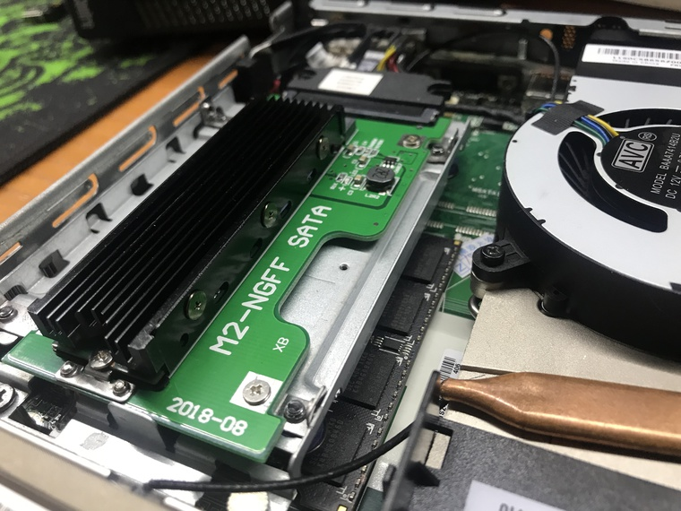

# Hackintosh for Lenovo ThinkCenter M93P (Translated by ProxyViper 10-06-2019 Original Author is feelinglucky)


## Overview

Lenovo's M93P is a relatively common handheld PC in the second-hand market. At present (at the end of 2018), the price of its second-hand system is generally around 300-400. Its Q87 chipset and Intel CPUs with four generations are very cost effective.

At the same time, the four generations of Intel CPUs are also relatively easy to black Apple's platform, so for the ease of use and cost-effective considerations, the Black Apple (Hackintosh) platform is assembled according to M93P.

The detailed configuration sheet is as follows:


```
Computer model              Lenovo M93P
CPU                         Intel i7-4720HQ (8) @ 2.60GHz
Memory                      8g DDR3 1600 MHz Elpida x2 (16g)
Integrated graphics         Intel HD Graphics 4600
Audio                       Realtek @ Intel Lynx Point-LP High Definition Audio (ALC283)
Ethernet                    Realtek RTL8168/8111/8112 Gigabit Ethernet Controller / Lenovo
Wireless network adapter    Broadcom BCM43xx 1.0 (7.21.190.32 AirPortDriverBrcm4360-1315.1)
Operate System              Mojave 10.14.2
```

Note: The i5-4570T CPU was originally used, but was later changed to the i7-4720HQ mobile version of the desktop 1150 model due to performance. Since the original machine does not have Bluetooth and wireless, it is equipped with Broadcom's 94352HMB model network card.
According to this configuration, the machine has been copied for nearly one month, and the use of stability can meet daily work tasks.
*2019-01-30, hardware update. * Use the matching external optical drive box to replace the optical drive box as a hard disk, and support the use of time capsule external hard disk backup (but the USB channel is taken, so the speed is not very good).
The current perfect situation:

1. Perfect sleep wake up, while turning on HiDPI support 2k display;
2. The USB port, network card and sound card can work normally;
3. After replacing the 4720HQ notebook CPU, the inverter can be converted by injecting SSDT with CPUFriend;
4. BCM94352HMB network card (MPICE interface) is installed, WIFI and Bluetooth can be used normally, and Bluetooth keyboard wake-up is supported at the same time;
5. iMessage and AirDrop can be used normally.
There are still some shortcomings:
1. The fan speed cannot be read;
2. Deep sleep (Hibernate) is not supported under Mojave.
3. There is no test for HDMI audio.


*2019-01-30 Update*, has been upgraded to 10.14.3, the sound card can not work during the upgrade process, after troubleshooting, it is found that Kernel Patch is a problem, remove it.


*2019-02-14 Update*, installed a new SSD drive and freezes the system at 10.13.6 (for performance and "no toss" considerations), plus a riser card for SSD and a heatsink.



## BIOS Settings

1. Set the initial memory of the kernel to 64M (this is very important, there are pits);
2. In the CPU settings, disable VT-d;
3. Only use UEFI mode;
4. Disable Security Chip
5. Disable Anti Theft Module
6. Disable TPM

## install the system

Install the latest version of the system, the individual uses the "Black Fruit Xiaobing" lazy package, currently supports version 10.14.2.

http://blog.daliansky.net/macOS-Mojave-10.14.2-18C54-official-version-with-Clover-4792-original-image.html

After installing the system, it is recommended to use the Clover build version of https://bitbucket.org/RehabMan/clover/downloads/. Personally, it is not recommended to use MultiBeast driver hardware, because the modification of the system is unknown and it also affects the later version upgrade.

If the hardware is similar to my hardware list above, then simply overwrite the EFI folder under Clover and restart (remember the backup). In theory, the sound card and the Broadcom wireless card and Bluetooth installed behind it can be driven.

The following highlights the driving and tuning of some important devices:


## Graphics card settings

The process of setting up the graphics card is a bit difficult. The original use is the i5-4570T CPU. The model that is displayed on the HD4600 is HD4600, so the CPU model of the notebook is also HD4600. However, after the same configuration file installation configuration went up, a splash screen appeared.

After debugging, I found that `ig-platform-id` is correct, but I need to patch the DSDT. This is a difficult place. The configuration aspect later used `FB-Patcher` to automatically generate and paste it into `config.plist`.
owever, after the <del> patch, the model number of the graphics card changed from `HD4600` to `Iris Pro` but no splash screen, the reason is unknown</del>:


<del> Then I didn't use the `WhatEverGreen` driver, or I used the fake FakePCIID series driver</del> (note that don't add unnecessary drivers, there is no benefit to stability).

The DSDT patch corresponding to HD4600, and also comment out the original definition field.
```dsl
Method (_DSM, 4, NotSerialized)
{
    If (LEqual (Arg2, Zero)) { Return (Buffer() { 0x03 } ) }
    Return (Package()
    {
        "RM, device-id", Buffer() { 0x12, 0x04, 0x00, 0x00 }
    })
}
```

*2019-01-04 Update*, use WhateverGreen.kext to perform a new graphics card patch operation, re-identifying the correct model and solving the problem of video crash under Safari.

To summarize, delete `ig-platform-id` and related definitions, delete the `FakePCIID*` series kernel extensions, and use `FB-Patcher` to make patches and apply VRAM patches. See here:

Https://www.tonymacx86.com/threads/an-idiots-guide-to-lilu-and-its-plug-ins.260063/


Reference link

* https://www.tonymacx86.com/threads/fix-intel-hd4200-hd4400-hd4600-mobile-on-yosemite.145427/
* https://github.com/RehabMan/OS-X-Fake-PCI-ID


## Sound card settings

The sound card originally used AppleDHA injection. Considering that this piece needs to be copied into `S/L/E` and there may be problems with future upgrades, AppleALC + Lilu and DSDT are used together with injection.

The M93P uses Reltek's ALC 283 audio chip, which uses the Apple ALC to drive the Layout Id to 1, which does not need to be set separately in config.plist.

It is also recommended to use the `FB-Patcher` tool, which can help you get the `config.plis semi-automatically.
 Part of the configuration.
t`
## CPU FM


Because it is a small chassis, the default frequency of heat is more serious, so use the extension `CPUFriend.kext`. More information can be found here https://github.com/acidanthera/CPUFriend, my current way is to use the `ssdtPRGen.sh` script, and then merge the SSDT configuration ([detailed] (https://github.com/acidanthera /CPUFriend/blob/master/Instructions.md)).


## Other

Compared to the last hardware (i5-4570T) upgrade, this EFI directory update is mainly two aspects:

1. Streamlined unnecessary kernel extensions (which will be more stable and easier to debug);
2. Be sure not to delete the "it seems redundant" efi file, otherwise it will not start;
3. Using the full patch of DSDT, it drives the CPU version of the mobile version.


## Reference link

* https://support.lenovo.com/us/en/solutions/pd027573
* https://www.tonymacx86.com/threads/an-idiots-guide-to-lilu-and-its-plug-ins.260063/
* https://www.tonymacx86.com/threads/guide-intel-framebuffer-patching-using-whatevergreen.256490/
* https://www.tonymacx86.com/threads/solved-how-to-make-alc283-work.220295/
* https://www.tonymacx86.com/threads/setting-up-graphics-acceleration-for-intel-hd-4600.231454/
* https://ark.intel.com/compare/78934,75045
* https://www.tonymacx86.com/threads/tips-for-installing-sierra-on-lenovo-m93p-tiny-i7.267593

`- eof -`
